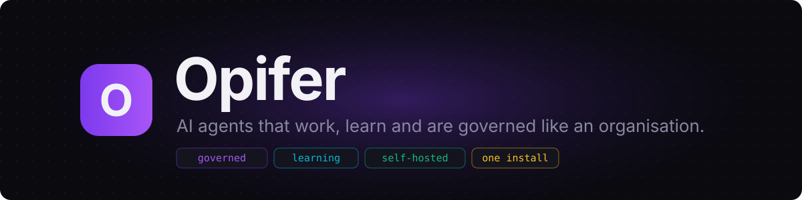
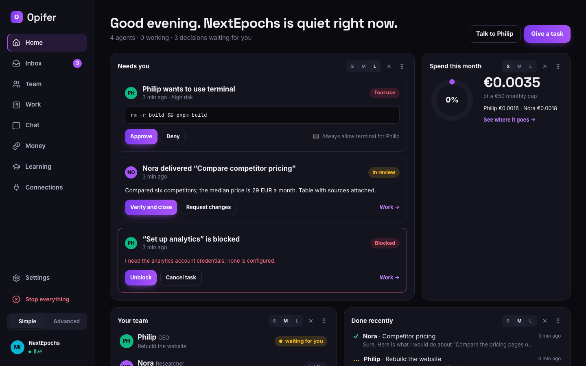
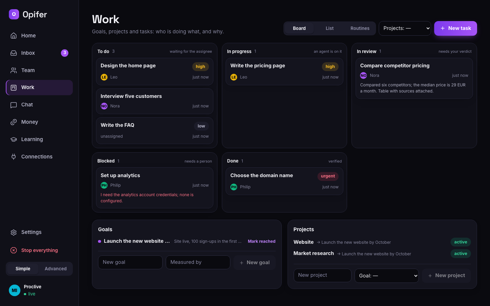

<p align="center">
  
</p>

<p align="center">
  <a href="#quick-start"><strong>Quick start</strong></a> &middot;
  <a href="docs/quickstart.md"><strong>Ten-minute guide</strong></a> &middot;
  <a href="docs/security.md"><strong>Security</strong></a> &middot;
  <a href="CHANGELOG.md"><strong>Changelog</strong></a> &middot;
  <a href="https://github.com/NextEpochs/opifer/releases"><strong>Releases</strong></a> &middot;
  <a href="https://opifer.dev"><strong>Website</strong></a>
</p>

<p align="center">
  <a href="https://github.com/NextEpochs/opifer/actions/workflows/ci.yml"></a>
  <a href="LICENSE"></a>
  <a href="plugins/LICENSE"></a>
  <a href="https://github.com/NextEpochs/opifer/releases/latest"></a>
  
  <a href="https://nextepochs.com"></a>
</p>

<br/>

# Opifer is where AI agents work, learn and are governed like an organisation.

**One installation, one database, one interface.** Agents get a boss, a job description, a budget and permissions. They take tasks, deliver results for review, and learn from what they did. The organisation governs them, and the person in charge sees costs and results in real time.

**If a chatbot is an employee, Opifer is the company.**

It looks like a friendly task board you walk through. Under the hood: an org chart, budgets reserved before every model call, approvals, encrypted secrets, an immutable audit log, and a learning loop that makes a repeated job cheaper the second time.

|        | Step              | What happens                                                                                                                       |
| ------ | ----------------- | ---------------------------------------------------------------------------------------------------------------------------------- |
| **01** | Hire the team     | Drag a role onto the org chart: a CEO, a researcher, a developer, a copywriter, support. Any model, any provider, or a local one. |
| **02** | Give the work     | A task in plain words: what to do, what _done_ means, who does it. The agent wakes up at once and knows _why_ the task matters.  |
| **03** | Decide and verify | Approvals, budget increases and deliveries land in your Inbox (or on Telegram). One click, and the agent carries on from there. |

<p align="center">
  
</p>

<br/>

## Opifer is right for you if

- ✅ You want a **team of AI agents that runs by itself**, but with a person deciding what matters
- ✅ You want every agent to have **a manager, a budget and permissions**, not a folder of prompts
- ✅ You are tired of **runaway loops and surprise bills**: the budget is reserved _before_ the call, and a reached cap stops the agent
- ✅ You want agents that **learn from their work** (memories and skills) without anyone re-training anything
- ✅ You want **recurring jobs** (reports, digests, health checks) that run at most once per due time, even after a crash
- ✅ You want to **self-host on one machine**, with an embedded database and nothing else to install
- ✅ You want to **approve from your phone** and stop everything with one red button

<br/>

## What you get

<table>
<tr>
<td align="center" width="33%">
<h3>🏢 An organisation</h3>
Agents have a boss, a title and a job description. Delegation flows down the org chart; whoever delegates reviews the result.
</td>
<td align="center" width="33%">
<h3>🎯 Work with a why</h3>
Goals, projects and tasks. Every task knows its chain (mission → goal → project → parent), and <em>done</em> only means <em>verified</em>.
</td>
<td align="center" width="33%">
<h3>💰 Budgets that bite</h3>
Caps per company, agent, project, task or turn. Cost is reserved before every model call; a reached cap stops the agent before the next one.
</td>
</tr>
<tr>
<td align="center">
<h3>🛡️ Governance</h3>
Permissions per role and agent, approvals that suspend and resume a turn, dangerous commands that always ask, an immutable audit log, revisions with restore.
</td>
<td align="center">
<h3>🧠 Learning that compounds</h3>
A background review keeps memories and skills (open agent-skills format) at agent, team and company scope. Nothing learned is ever deleted; promotion is governed.
</td>
<td align="center">
<h3>⏰ Routines</h3>
"Every Monday at 9", a cron expression, a date. Each due time runs at most once. A routine can run as a task the agent delegates and gets reviewed.
</td>
</tr>
<tr>
<td align="center">
<h3>🔌 Connections</h3>
MCP servers and workflow endpoints (n8n, Zapier, Make, a script) as governed tools. Inbound webhooks, outbound signed events, a Telegram bot.
</td>
<td align="center">
<h3>🔐 Secrets that never leak</h3>
Encrypted per company, bound to an agent and a tool, injected only into the tool call, redacted from its output. Never in the model's context.
</td>
<td align="center">
<h3>🛑 Emergency stop</h3>
One button: every running turn is interrupted, routines pause, no model is called until a person resumes.
</td>
</tr>
</table>

<br/>

## Why Opifer is solid

Twenty invariants are the contract of the system and outweigh any feature. They live in [`packages/core/src/invariants.ts`](packages/core/src/invariants.ts) and each one is a contract test. A few of them:

|                                    |                                                                                                                                                                             |
| ---------------------------------- | --------------------------------------------------------------------------------------------------------------------------------------------------------------------------- |
| **Budget before the call.**        | Every model call reserves its estimated cost first. Reservations are serialised per company, so an overrun is at most one call.                                             |
| **Atomic checkout.**               | A task has one assignee, taken with a single conditional `UPDATE`; a hundred concurrent checkouts produce one winner. A lease with a heartbeat frees the task if the agent dies. |
| **Done means verified.**           | No task closes without a result and a verification, by a person or by the reviewing agent. A parent closes only after its children.                                         |
| **At most once.**                  | Wake-ups and routine runs are rows with a unique key: a second scheduler, or the same one after a crash, cannot run them twice.                                              |
| **Secrets never in context.**      | A value that leaks into a command's output comes back as `[redacted:NAME]`; the API never returns a value; every access is logged.                                          |
| **Never delete what was learned.** | A memory is corrected or retired, never erased; a skill goes inactive, then archived, and comes back with one click.                                                        |
| **Versioned configuration.**       | Every change to an agent is a revision that can be restored. The audit log accepts inserts only.                                                                            |
| **Learn outside the turn.**        | The review reads a copy of the finished conversation, never the live session, and is charged to the agent like any other cost.                                              |

<br/>

## Quick start

Node.js 22. Nothing else: PostgreSQL is embedded, Docker is optional.

```bash
npm install -g @opifer/cli             # the o4r command
o4r init --company "My company"        # local database, migrations, first company
o4r up --detach                        # http://127.0.0.1:4700
o4r doctor                             # every check green?
```

From the repository instead (to develop, or to run the latest main): `git clone https://github.com/NextEpochs/opifer.git && cd opifer && pnpm install && pnpm build`, then the same commands as `pnpm o4r …`.

Give it a model, then open the interface:

| Provider                           | How                                                                                                  |
| ---------------------------------- | ---------------------------------------------------------------------------------------------------- |
| **Anthropic**                      | `export ANTHROPIC_API_KEY=…`                                                                         |
| **OpenAI**                         | `export OPENAI_API_KEY=…`                                                                            |
| **ChatGPT subscription** (no key)  | `o4r login chatgpt`, then `o4r init --model chatgpt/<model>` — models are billed to the plan |
| **Local model** (Ollama, LM Studio, vLLM, llama.cpp) | `o4r init --local-url http://127.0.0.1:11434/v1 --model local/llama3`         |

The default model is `--model provider/model`; `o4r doctor` shows which providers are active. Keys can also live in the encrypted vault (`o4r secret set`).

Want to look around first? `o4r demo` creates a company with four agents, goals, tasks in every state, memories, skills, routines and connections, without calling any model.

📖 **[The ten-minute guide →](docs/quickstart.md)**

> The ChatGPT sign-in is the same one OpenAI ships in its Codex CLI: OpenAI publicly tolerates third-party tools using it, but nothing in its terms guarantees it. Use your own account and expect it to change. `o4r logout chatgpt` removes the credentials.

<br/>

## The interface

Opifer is a company you walk through, not an admin panel. **Home** is a board of widgets you drag, resize and add to. **Inbox** holds every decision a person has to take, explained in plain words, with one-click answers and keyboard shortcuts. **Team** is an org chart: drag a role onto the person it should report to and you are hiring. **Work** is a board of goals, projects and tasks. **Learning** shows what the company has learned. **Connections** shows what the agents can reach. **Chat** talks to any agent. **Money** shows where every cent goes.

A _Simple / Advanced_ switch keeps the same screens and adds the technical layer for power users. English by default, Italian available, dark and light themes, installable as a PWA, zero axe violations on every page (WCAG 2.1 AA).

<p align="center">
  
</p>

To see the interface with scripted agents and no real model: `pnpm build && node packages/server/dist/preview.js`, then open http://127.0.0.1:4790.

<br/>

## Command line

Everything the interface does, the `o4r` command and the `/v1` API do too.

| Area            | Commands                                                                                                                                                                                                           |
| --------------- | ------------------------------------------------------------------------------------------------------------------------------------------------------------------------------------------------------------------ |
| **Server**      | `o4r init` · `o4r up [--detach]` · `o4r down` · `o4r status` · `o4r doctor` · `o4r migrate status\|up\|down` · `o4r stop` / `o4r resume` (emergency stop) · `o4r export` / `o4r import` · `o4r demo`               |
| **Models**      | `o4r login chatgpt` · `o4r logout chatgpt` · `o4r init --model provider/model` · `o4r init --local-url …`                                                                                                          |
| **Talk**        | `o4r chat "Agent name"` · `o4r chat --resume <session id>`                                                                                                                                                         |
| **Work**        | `o4r task create "…" --agent Leo --acceptance "…"` · `o4r task [show\|comment\|assign\|complete\|request-changes\|block\|unblock\|cancel\|release]`                                                                |
| **Routines**    | `o4r routine create "Weekly digest" --agent Philip --every "monday 9" --as-task --prompt "…"` · `o4r routine run\|runs\|enable\|disable\|remove`                                                                   |
| **Governance**  | `o4r budget set --cap 20 [--agent Philip]` · `o4r costs` · `o4r policy set terminal automatic --agent Philip` · `o4r approvals [approve\|deny] <id>` · `o4r secret set NAME` · `o4r secret bind NAME --agent … --tool …` |
| **Learning**    | `o4r memory [--agent Philip] [--query …]` · `o4r memory add "…" --pin` · `o4r skill [show\|install <dir>\|export\|restore\|promote\|archive]` · `o4r learning set promotion automatic\|review\|forbidden`             |
| **Connections** | `o4r connection add-mcp github --command npx --args "-y,@modelcontextprotocol/server-github" --secret GITHUB_TOKEN` · `o4r connection add-workflow n8n_report --url …` · `o4r webhook create\|subscribe` · `o4r channel add-telegram\|pair` |

<br/>

## How the work flows

**Tasks.** An agent is assigned a task, wakes up, works in its own session, delivers a result, and a person (or the reviewing agent) verifies it. One assignee at a time, taken with an atomic checkout; a lease with a heartbeat, so a task whose agent dies goes back to the queue and is blocked after two failures instead of looping forever. Comments with `@Name` wake that agent; a task waiting for an approval resumes on the decision. Agents get the matching tools (`task_status`, `task_comment`, `task_create` to delegate downward, `task_deliver`, `task_block`, `task_approve`, `task_request_changes`) and a brief with the task, its why chain and the rules.

**Email.** A mailbox is a connection: SMTP to send, IMAP to read and search, the password a company secret. Reading is automatic; every email an agent sends asks a person first until sending is allowed for that agent.

**The web.** `web_fetch` reads any public page or API as clean text; `web_search` searches through Brave, Tavily or your own SearXNG when a key or URL is configured. Every number an agent reports comes with its source.

**Software.** A project can be a git repository: cloned into its folder, worked on a branch, pushed with a token kept as a company secret. Agents get `edit_file`, `apply_patch` and a terminal with the network on and build tools, and, when Claude Code or the Codex CLI is installed on the machine, `run_coder`: they hand it a full brief and it does the multi-step work in the project folder, under the same approvals and review. Everything produced is under **Artifacts**, to open or download.

**Delegation closes the loop.** Whoever delegates becomes the reviewer of the subtask: woken up on delivery, it checks the result and approves it or sends it back. A parent is delivered only after its subtasks are closed. In a chat, an agent can read the company status and hand out work to its reports.

**Learning.** After every finished conversation or task a background review reads a copy of it and keeps what is worth keeping: short memories (how to work here, who prefers what) and, when a procedure emerged, a skill (a `SKILL.md` in the open [agent-skills](https://agentskills.io) format, with versions). The next session starts with a capped memory snapshot and the index of its skills; the body of a skill is loaded on demand. In the test suite the second run of the same job is 45% cheaper. A skill that proves itself is proposed for the whole company, under the company policy: `automatic`, `review` (a card in the Inbox, the default) or `forbidden`.

**Routines.** An agent, a prompt, a schedule (`every 2 hours`, `monday 9`, a cron expression, a date) and where the result goes. Missed due times inside the catch-up window run late; older ones are recorded as skipped. With `--as-task` every run becomes a task, so the agent can delegate, be reviewed and verified like any other work.

**Connections.** MCP servers (local command or remote URL, secrets by name) and workflow endpoints become tools named `<connection>__<tool>`, under the same gate as native tools: permissions per role, approvals, budget, audit. Inbound webhooks let an automation create a task, wake an agent, comment or decide an approval with one `POST /v1/hooks/<id>` and a bearer token shown once. Outbound events are signed (`X-Opifer-Signature: t=<unix>,v1=HMAC-SHA256(secret, "<unix>.<body>")`) and retried with backoff. A Telegram bot per company lets you talk to the agents from your phone and approve with one tap; unknown senders get a pairing code and nothing else.

**Sandbox.** Commands run by the agents execute in a Docker container with no network and only the task's folder mounted, whenever a Docker daemon is available; otherwise they run on the machine, and the interface, `o4r doctor` and `/v1/health` say so.

<br/>

## Under the hood

Opifer is a Node.js server with a React interface, one PostgreSQL database and a set of provider and channel plugins.

```
┌──────────────────────────────────────────────────────────────────┐
│                          OPIFER SERVER                           │
│                                                                  │
│  ┌────────────┐  ┌────────────┐  ┌────────────┐  ┌────────────┐  │
│  │  Runtime   │  │  Gateway   │  │    Work    │  │  Learning  │  │
│  │ agent loop │  │  budgets   │  │ goals/tasks│  │  memories  │  │
│  │ providers  │  │ approvals  │  │  routines  │  │   skills   │  │
│  │  context   │  │  secrets   │  │  wake-ups  │  │   review   │  │
│  └────────────┘  └────────────┘  └────────────┘  └────────────┘  │
│                                                                  │
│  ┌────────────┐  ┌────────────┐  ┌────────────┐  ┌────────────┐  │
│  │Connections │  │ Scheduler  │  │  Audit &   │  │  Company   │  │
│  │ MCP, hooks │  │ leases,    │  │  events    │  │  export/   │  │
│  │ channels   │  │ at-most-1  │  │  bus, WS   │  │  import    │  │
│  └────────────┘  └────────────┘  └────────────┘  └────────────┘  │
│                                                                  │
│                   PostgreSQL (embedded, one database)            │
└──────────────────────────────────────────────────────────────────┘
        ▲               ▲               ▲               ▲
  ┌─────┴─────┐   ┌─────┴─────┐   ┌─────┴─────┐   ┌─────┴─────┐
  │ Anthropic │   │  OpenAI / │   │  Local    │   │ Telegram, │
  │           │   │  ChatGPT  │   │  models   │   │ webhooks  │
  └───────────┘   └───────────┘   └───────────┘   └───────────┘
```

| Package                | Contents                                                                                                                              |
| ---------------------- | ------------------------------------------------------------------------------------------------------------------------------------- |
| `packages/core`        | Domain model, invariants, events                                                                                                      |
| `packages/db`          | Schema, forward and backward migrations, embedded Postgres                                                                            |
| `packages/runtime`     | Agent loop, model providers, context compression                                                                                      |
| `packages/gateway`     | Governance: budget reservation, permissions, approvals, secrets, governed tool executor                                                |
| `packages/work`        | Goals, projects, tasks and routines: atomic checkout, leases, results, wake-ups, at-most-once runs, task tools for agents               |
| `packages/learning`    | Memory and skills at three scopes, snapshot for the prompt, search, versions, curator, promotion, background review                    |
| `packages/connections` | Tool connections (MCP servers, workflow endpoints), inbound webhooks, outbound signed events, messaging channels and pairing            |
| `packages/server`      | HTTP API `/v1`, WebSocket events, the scheduler, the learning worker, the channel hub, export/import, the demo company                  |
| `packages/ui`          | Web interface (React, Vite, Tailwind; dnd-kit boards, React Flow org chart)                                                            |
| `packages/cli`         | The `o4r` command                                                                                                                     |
| `packages/sdk`         | Contracts for plugins, channels, providers (MIT)                                                                                      |
| `plugins/*`            | Plugins maintained by NextEpochs (MIT): Anthropic, OpenAI (API key and ChatGPT sign-in), OpenAI-compatible endpoints, the Telegram channel |

Numbers from the release: a clean install on a fresh Linux VM takes under a minute; the load test (20 agents, 200 tasks, 10 concurrent runs, scripted model) completes 220 runs in 13 s on 2 vCPU with none failed; the full end-to-end scene of the specification runs as a contract test.

<br/>

## Documentation

The guides are also on [opifer.dev](https://opifer.dev/docs/quickstart/), rendered from this repository.

| Document                               | What it covers                                                                          |
| -------------------------------------- | --------------------------------------------------------------------------------------- |
| [Ten-minute guide](docs/quickstart.md) | Install → model → first agent → first task → money, permissions, learning, routines     |
| [Security](docs/security.md) and [SECURITY.md](SECURITY.md) | Trust model, secrets, sandbox, known gaps; how to report a vulnerability privately |
| [Changelog](CHANGELOG.md)              | What each release brought, milestone by milestone                                       |
| [AGENTS.md](AGENTS.md)                 | The rules of this repository for people and development agents                          |
| [CONTRIBUTING.md](CONTRIBUTING.md) and [CLA.md](CLA.md) | How to report, propose and submit a change: sign-off on every commit, the contributor agreement |
| [Invariants](packages/core/src/invariants.ts) | The twenty rules that outweigh any feature, each with a contract test              |

<br/>

## Deployment

Two modes. **Local**: one machine, no sign-in, the server on `127.0.0.1`. **Authenticated**, for a server or a VPS: `o4r init --auth --email you@example.com` (or `o4r auth enable`), and every call to the interface and the API needs a signed-in person or an API key, with a role (observer, operator, admin, owner). Keep Opifer on `127.0.0.1` behind nginx or Caddy with HTTPS; the interface works at the root or under a path. People: `o4r user add`; keys for integrations: `o4r apikey create`. The nginx snippet is in the [ten-minute guide](docs/quickstart.md#on-a-server); what is protected and how in [docs/security.md](docs/security.md).

**Updating**: `o4r update` installs the latest version from npm where this one is installed and restarts the server (`--check` only tells you); data, configuration and keys stay. Settings and `o4r doctor` say when a newer version is out (one look at npm a day, `updates.check: false` turns it off).

For servers and cloud there is a container image:

```bash
docker compose up -d      # builds the image, creates database and first company in the opifer-data volume
```

The compose file binds the port to `127.0.0.1` on purpose. Agents' commands run in a Docker sandbox with no network whenever a daemon is reachable, verified on Linux with Docker 29.

<br/>

## Status and roadmap

**1.1.0 is out**: everything above runs end to end, in tests, live on the Mac it was built on and on a second Linux machine with Docker. What comes next, in order:

- Per-company roles (today they are server-wide: one team per server)
- Docker sandbox verified on more machines; hardened runtimes as a deployment option
- More channels (Slack, Discord, email) beside Telegram
- Team-scope learning written by the review, not only by hand
- Semantic search without an external embedding provider

<br/>

## Development

```bash
pnpm install && pnpm build       # whole monorepo (tsc -b + vite)
pnpm typecheck && pnpm test      # vitest, embedded Postgres per test file, about 90 s
pnpm dev                         # server in development mode
pnpm --filter @opifer/ui dev     # interface in development mode
node packages/server/dist/preview.js 4790    # interface with scripted agents
node packages/server/scripts/load-test.mjs   # 20 agents, 10 concurrent runs
```

Contributions are welcome: [CONTRIBUTING.md](CONTRIBUTING.md) has the agreement (a sign-off on every commit) and the checklist. Read [AGENTS.md](AGENTS.md) first: TypeScript strict and ESM, everything in English, migrations in up/down pairs, files under 1,500 lines, no secrets anywhere, `npx prettier --write` before every commit. A change that violates an invariant is not made: the specification is discussed instead.

<br/>

## Licences

The Opifer core is distributed under the **AGPL-3.0-only** licence (see [LICENSE](LICENSE)). The SDK (`packages/sdk`) and the plugins (`plugins/*`) are distributed under the **MIT** licence, so whoever extends Opifer is not bound by the AGPL. The NextEpochs vertical packages are proprietary and live in separate repositories.

The licences of the dependencies are collected in [`THIRD-PARTY-NOTICES`](THIRD-PARTY-NOTICES), regenerated at every release with `pnpm third-party-notices`.

<p align="center">
  <sub>Opifer is a <a href="https://nextepochs.com">NextEpochs</a> product. Website and documentation: <a href="https://opifer.dev">opifer.dev</a>.</sub>
</p>
